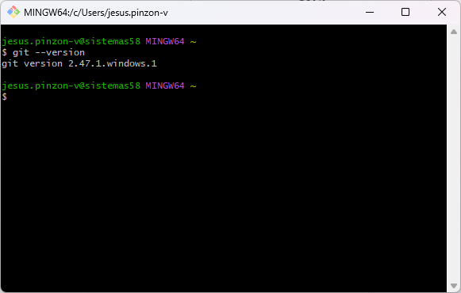
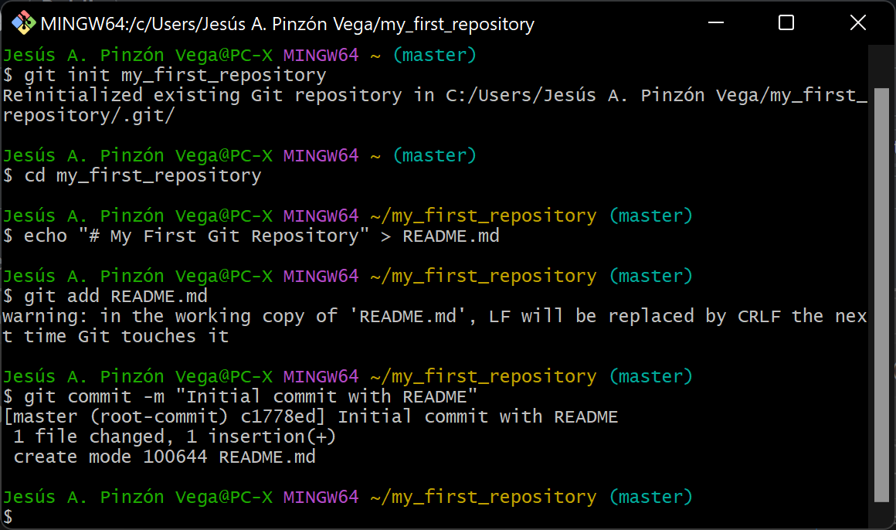
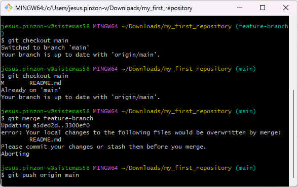

# My First Git Repository  

This repository documents my learning process with Git and GitHub as part of the "Software Development Life Cycle" course. Below are the steps I followed to create and manage this repository, along with evidence screenshots:  

---

## PART

### Step 1: Installing Git  

First, I installed Git on my system and verified the installation:  

```bash
git --version
```




### Step 2: Configuring Git

set up my user information for Git:

```bash
git config --global user.name "Your Name"
git config --global user.email "your.email@example.com"
```


### Step 3: Creating a Local Repository

```bash
git init my_first_repository
cd my_first_repository
```


### Step 4: Adding a README.md File

I created a README.md file and added some content:

```bash
echo "# My First Git Repository" > README.md
```

Then, I added and committed the file:




### Step 5: Connecting to GitHub

I created a repository on GitHub and linked it to my local repository:

```bash
git remote add origin https://github.com/JAPV-X2612/my_first_repository.git
```

I pushed my local repository to GitHub:

```bash
git push -u origin main
```


### Step 6: Making Changes and Using Git Workflow

Created a new branch and switched to it:

```bash
git checkout -b feature-branch
```

Made some changes, then committed and merged the branch:

```bash
git add .
git commit -m "Added new feature"
git checkout main
git merge feature-branch
```

Finally, I pushed the changes to GitHub:

```bash
git push origin main
```




### Step 7: Making Changes on README.md File

These are some changes to the README.md file made by Jesús Pinzón (Owner).


# editado