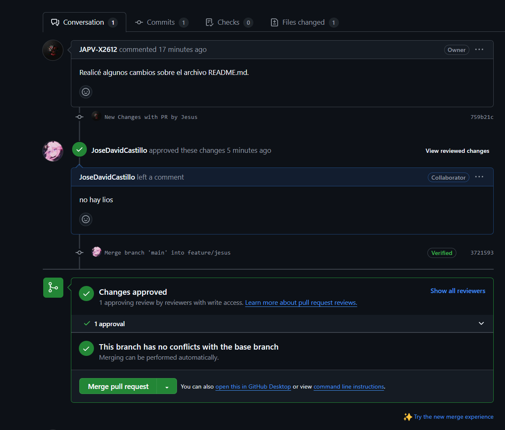

# **My First Git Repository**


This repository documents my learning process with Git and GitHub as part of the "Software Development Life Cycle" course. Below are the steps I followed to create and manage this repository, along with evidence screenshots:  

### **Members**

- **Jesús Alfonso Pinzón Vega** - <u>GitHub Username</u>: [JAPV-X2612](https://github.com/JAPV-X2612) (Owner)
- **José David Castillo Rodríguez** - <u>GitHub Username</u>: [JoseDavidCastillo](https://github.com/JoseDavidCastillo) (Collaborator)
- **Mayerlly Suárez Correa** - <u>GitHub Username</u>: [corrllr](https://github.com/corrllr) (Collaborator)


---

## **PART I (Individual Work)**

### Step 1: Installing Git  

First, I installed [Git](https://git-scm.com/downloads) on my system and verified the installation:  


```bash
git --version
```


### Step 3: Create a GitHub Account 

I went to the official [GitHub](https://github.com/) page and created a personal account:


### Step 4: Configuring Git

Set up my user information for Git and confirm the information:

```bash
git config --global user.name JAPV-X2612
git config --global user.email jesus.pinzon-v@mail.escuelaing.edu.co
git config --list
```


### Step 5: Creating a Local Repository

I initialized a new Git repository:

```bash
git init my_first_repository
cd my_first_repository
```


### Step 6: Adding a README.md File

I created a `README.md` file and added some content:

```bash
echo "# My First Git Repository" > README.md
```

Then, I added and committed the file:

```bash
git add README.md
git commit -m "Initial commit with README"
```


### Step 7: Connecting to GitHub

I created a repository on GitHub and linked it to my local repository:

```bash
git remote add origin https://github.com/JAPV-X2612/my_first_repository.git
```

I pushed my local repository to GitHub:

```bash
git push -u origin main
```


### Step 8: Making Changes and Using Git Workflow

I created a new branch and switched to it:

```bash
git checkout -b feature-branch
```

Made some changes, then committed and merged the branch:

```bash
git add .
git commit -m "Added new feature"
git checkout main
git merge feature-branch
```

Finally, I pushed the changes to GitHub:

```bash
git push origin main
```


---


## **PART II (Pair Work)**

### Step 1: Definition of Roles

For this part of the lab, I decided to work with **<u>José David Castillo Rodríguez</u>** and **<u>Mayerlly Suárez Correa**</u>. The three of us chose my repository as the main one, so I would take on the role of ***owner*** and they would take on the role of ***collaborators***.


### Step 2: Adding Collaborators

To add collaborators, I clicked on the "Settings" tab and then on the "Collaborators" tab. I added the collaborator's GitHub username and confirmed the invitation:


### Step 3: Editing the README.md file at the same time

I edited the `README.md` file at the same time as José and Mayerlly, and then I merged the changes:

```bash
git add .
git commit -m "Edited README.md"
git checkout main
git merge feature-branch
```

Then, I pushed the changes to GitHub:

```bash
git push origin main
```


My update to the `README.md` file repository uploaded successfully. However, my colleagues' updates got a red error, indicating that the repository could not be updated:


### Step 4: Resolving Conflicts

When José and Mayerlly tried to upload their modifications, a parallel file to the original `README.md` was automatically opened in which they could see labels of the form <<< === >>> asking them to resolve the update conflicts.


Then, each of them proceeded to resolve their respective conflicts manually and tried to upload the changes again as shown in the images below:


---


## **PART III (Teamwork)**

To avoid update issues like the one we had in the previous case, we are now going to use Pull Requests (PR), which are requests to merge changes from one branch to another in a GitHub repository, allowing review and collaboration before integration.

### Step 1: Setting Pull Requests (PR)

As a first step, I as the repository owner must create a rule so that PRs are mandatory before merging changes with the main branch and I must also define a minimum number of reviews to accept or reject the changes.


### Step 2: Deleting Branches after a PR

Additionally, I'm going to create another rule on PRs so that after making and accepting one, the branch from which the PR was made is automatically deleted.


### Step 3: Creating Branches

To organize our work and prevent conflicts, each team member created their own test branch before making changes to the repository. This way, we could work independently and later merge the modifications through a Pull Request (PR).  

Each collaborator created a new branch using the following command:  

```bash
git checkout -b feature/test-branch
```

Then, everyone pushed their branches to GitHub using the following command:

```bash
git push -u origin feature/test-branch
```

By following this workflow, we ensured that all changes were reviewed and approved before merging them into the main branch.


### Step 4: Creating a Pull Request  

Each team member modified the `README.md` file from their local machine, uploaded the changes to their respective branches, and created a PR to merge the changes into the main branch.  

After making the necessary edits, we committed and pushed the changes:  

```bash
git add README.md
git commit -m "Updated README.md with new changes"
git push origin feature/test-branch
```

Once the changes were pushed, each collaborator opened GitHub, navigated to their branch, and clicked "New Pull Request" to propose the changes. To ensure code quality and collaboration, we reviewed each other's PRs. We checked for errors, left comments, and approved the changes.

After the review, we accepted and merged the PRs into the main branch. This process ensured that all modifications were validated before integration.

**<u>Jesus (PR by Mayerlly):</u>**


**<u>Mayerlly (PR by Jose):</u>**


**<u>Jose (PR by Jesus):</u>**




### Step 5: Checking the Current State of the Repository  

After successfully merging the Pull Requests, we verified the current state of the repository to ensure that all changes were correctly integrated.  

We used the following command to review the latest commits and confirm that all contributions were recorded:  

```bash
git log --oneline --graph --all
```


---


## **Conclusions**  

Through this project, we gained hands-on experience with Git and GitHub, reinforcing key concepts such as repository management, branching, collaboration, and conflict resolution. By working as a team, we learned the importance of using branches and Pull Requests (PRs) to maintain an organized and efficient workflow. Additionally, resolving merge conflicts allowed us to understand the importance of clear communication and version control best practices. This lab provided us with essential skills that will be invaluable for future software development projects.  

---